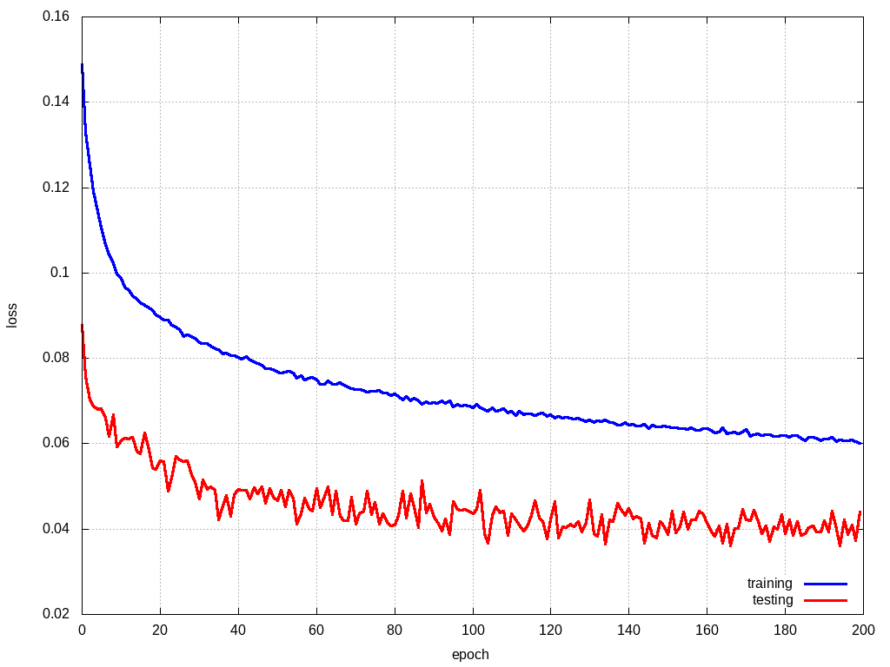

## car detection using magnetic field

class IDs
- 0 : no car or in oposite way
- 1 : car or motorcycle
- 2 : delivery van, less than 3.5t
- 3 : truck, above 3.5t

### dataset notes
time window with length 512 samples, on three axis (XYZ) + padding dummy channel

classes counts : 
class		count		relative[%]
0 		 8291 		 61.64
1 		 4270 		 31.75
2 		 340 		 2.53
3 		 549 		 4.08

the 20% of items was used for testing, remaining 80% for training + 10x augmentation

### results net0

1D convs, kernel size 3, stride 2
IN4x512 - C8x3/2 - C16x3/2 - C32x3/2 - C64x3/2 - C4x1 - GAP - Flatten

**accuracy   = 93.532 [%]**
class_accuracy = 96.911%   88.095%   79.412%   82.692%   

model link : [results](models/magnetometer_net_0/model.py)
result link : [results](models/magnetometer_net_0/result)

