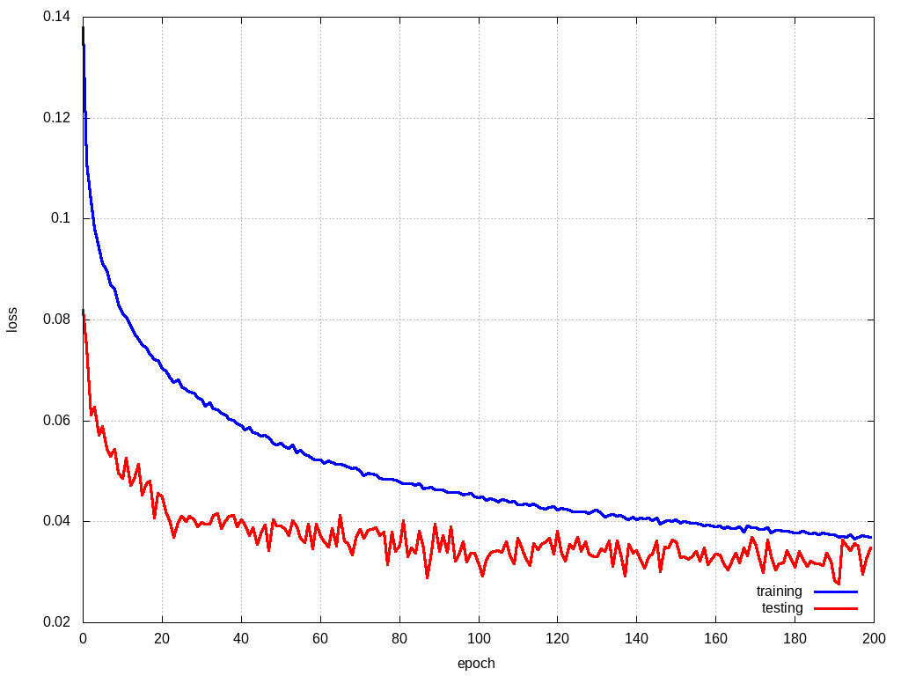
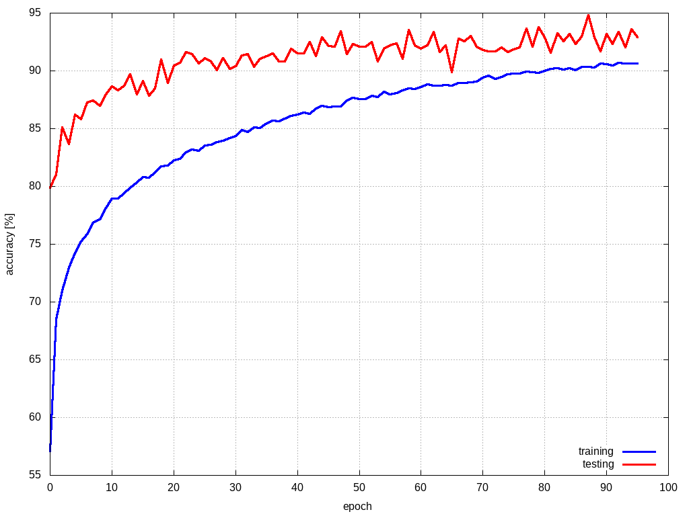
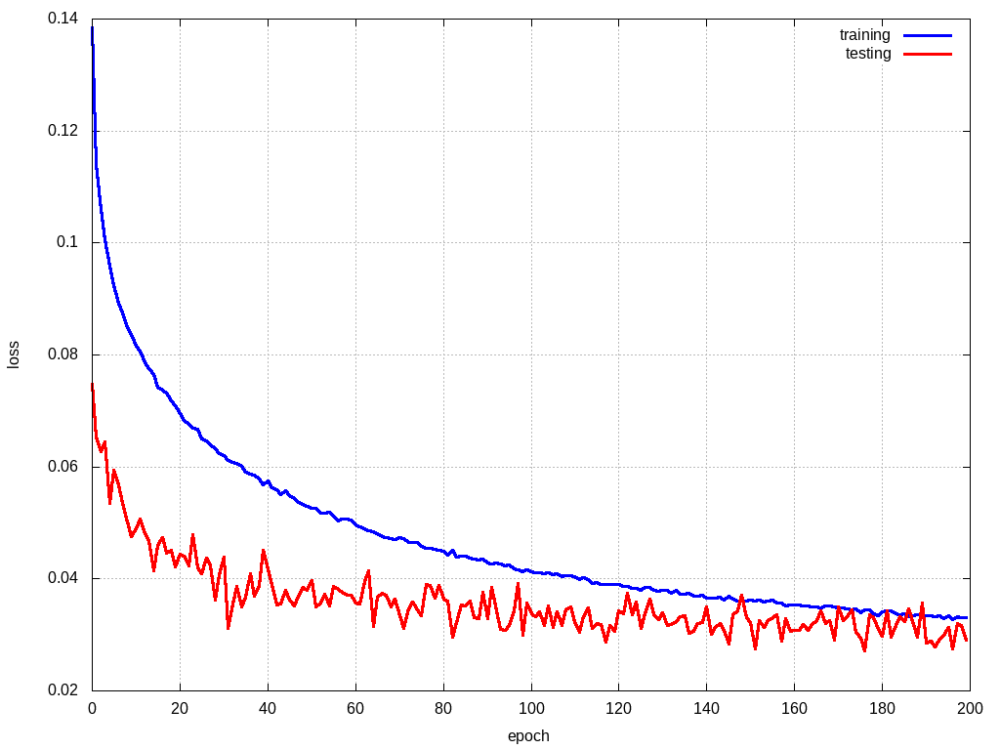

## car detection using magnetic field

class IDs
- 0 : no car or in oposite way
- 1 : car or motorcycle
- 2 : delivery van, less than 3.5t
- 3 : truck, above 3.5t

### dataset notes
time window with length 512 samples, on three axis (XYZ) + padding dummy channel

classes counts : 
class		count		relative[%]
0 		 8291 		 61.64
1 		 4270 		 31.75
2 		 340 		 2.53
3 		 549 		 4.08

the 20% of items was used for testing, remaining 80% for training + 10x augmentation

### hyperparameters

- learning rate : cyclic,  [0.001, 0.0001, 0.0001, 0.0001, 0.00001, 0.00001]
- weight decay  : learning_rate*0.001
- epoch count : 200
- batch size  : 64
- dropout     : 5%

### results net_0

1D convs, kernel size 3, stride 2

last conv is 1D conv, channels = num. classes (4), followed byt global average pooling

IN4x512 - C8x3/2 - C16x3/2 - C32x3/2 - C64x3/2 - C4x1 - GAP - Flatten

**accuracy   = 93.532 [%]**

class_accuracy = 96.911%   88.095%   79.412%   82.692%   

model link : [results](models/magnetometer_net_0/model.py)

result link : [results](models/magnetometer_net_0/result)

### results net_1

1D convs, kernel size 3, stride 2

last conv is 1D conv, channels = num. classes (4), followed byt global average pooling

IN4x512 - C16x3/2 - C16x3/2 - C32x3/2 - C32x3/2 - C64x3/2 - C128x3/2 - C4x1 - GAP - Flatten

**accuracy   = 95.058 [%]**

class_accuracy = 97.783%   90.979%   75.0%   84.483%   

model link : [results](models/magnetometer_net_1/model.py)

result link : [results](models/magnetometer_net_1/result)

### results net_2
 
1D convs, kernel size 3, stride 2

last conv is 1D conv, channels = num. classes (4), followed byt global average pooling

IN4x512 - C16x3/2 - C32x3/2 - C32x3/2 - C64x3/2 - C64x3/2 - C128x3/2 - C4x1 - GAP - Flatten

**accuracy   = 94.985 [%]**

class_accuracy = 98.829%   90.521%   71.429%   82.258%   

model link : [results](models/magnetometer_net_2/model.py)

result link : [results](models/magnetometer_net_2/result)

### results net_3
 
1D convs, kernel size 3, stride 2

last layer is fully connected, out_features = num. classes (4)

IN4x512 - C16x3/2 - C32x3/2 - C32x3/2 - C64x3/2 - C64x3/2 - C128x3/2 - Flatten - FC4

**accuracy   = N/A**

class_accuracy = N/A

model link : [results](models/magnetometer_net_2/model.py)

result link : [results](models/magnetometer_net_2/result)

