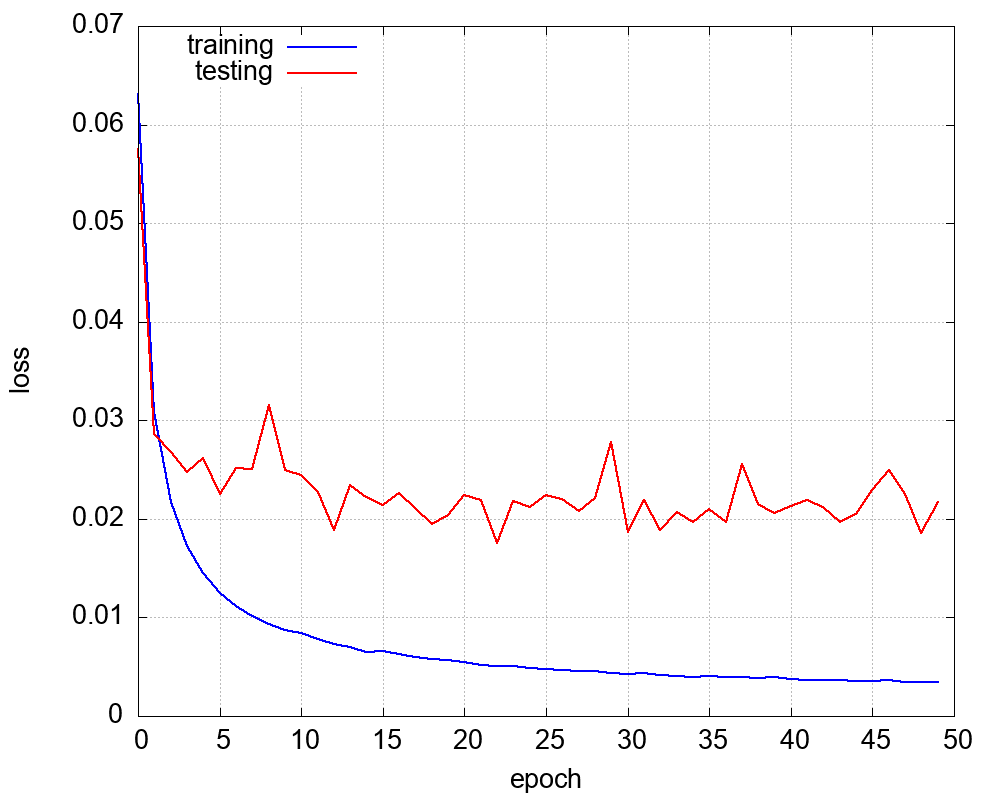

# car detection using magnetic field

class IDs
- 0 : no car or in oposite way
- 1 : car or motorcycle
- 2 : delivery van, less than 3.5t
- 3 : truck, above 3.5t
- 4 : heavy truck


the sensor is streaming 3-axis data of magnetic field :


## dataset notes
time window with length 512 samples, on three axis (XYZ) + padding dummy channel

classes counts : 

class		count		relative[%]
- 0 		 13023 		 56.93
- 1 		 7887 		 34.48
- 2 		 649 		 2.84
- 3 		 479 		 2.09
- 4 		 837 		 3.66


the 20% of items was used for testing, remaining 80% for training + 10x augmentation

some basic preprocessing was used 
- normalisation, each axis independed : x_norm = (x - x.mean())/x.var()
- augmentation : random white noise, random DC offset, random signal center shift

## hyperparameters

- learning rate : cyclic, [0.001, 0.001, 0.0001, 0.0001, 0.0001, 0.00001, 0.00001]
- weight decay  : learning_rate*0.001
- epoch count : 50
- batch size  : 64
- dropout     : 1%


## net_4


- pytorch model   [model.py](models/net_4/model.py)
- pytorch weights [model.pt](models/net_4/trained)
- embedded export float [export_float](models/net_4/export_float)
- embedded export int8 [export_int8](models/net_4/export_int8)
- for embedded run use **/embedded_inference/libs_embedded_neural_network**
- best model result [best.log](models/net_4/result/best.log)
- **need multiply input by x64** for int8 quantized

### architecture

```python
nn.Conv1d(4, 8, kernel_size = 8, stride = 4, padding = 0),
nn.ReLU(), 

nn.Conv1d(8, 16, kernel_size = 8, stride = 4, padding = 0),
nn.ReLU(), 

nn.Conv1d(16, 32, kernel_size = 8, stride = 4, padding = 0),
nn.ReLU(), 

nn.Flatten(), 
nn.Dropout(p=0.01),
nn.Linear(6*32, 5)
```

### training progress
note - training data are heavily noised, that's why training set have higher loss


### exported **float32** result

```
accuracy   = 92.391 [%]
hit_count  = 1360
miss_count = 112

class_accuracy = 97.791%   88.785%   52.5%   70.968%   81.356%   


confusion_matrix = 
         841           4           0           0           0
           8         380          16           3           0
           2          18          21           5           5
           5          19           2          22          16
           3           6           0           0          96
```

### exported quantized **int8** result

```
accuracy   = 87.976 [%]
hit_count  = 1295
miss_count = 177

class_accuracy = 98.601%   73.286%   65.0%   51.282%   79.487%   


confusion_matrix = 
         846           9           0           1           2
           4         310          11           2           0
           0          81          26          12           3
           0          19           2          20          18
           7           3           0           3          93

```


## net_5

- pytorch model   [model.py](models/net_5/model.py)
- pytorch weights [model.pt](models/net_5/trained)
- embedded export float [export_float](models/net_5/export_float)
- embedded export int8 [export_int8](models/net_5/export_int8)
- for embedded run use **/embedded_inference/libs_embedded_neural_network**
- best model result [best.log](models/net_5/result/best.log)
- **need multiply input by x32** for int8 quantized


### architecture

```python
nn.Conv1d(4, 16, kernel_size = 8, stride = 4, padding = 0),
nn.ReLU(), 

nn.Conv1d(16, 32, kernel_size = 8, stride = 4, padding = 0),
nn.ReLU(), 

nn.Conv1d(32, 64, kernel_size = 8, stride = 4, padding = 0),
nn.ReLU(), 

nn.Flatten(), 
nn.Dropout(p=0.01),
nn.Linear(6*64, 5)
```

### training progress
note - training data are heavily noised, that's why training set have higher loss




### exported **float32** result

```
accuracy   = 92.663 [%]
hit_count  = 1364
miss_count = 108

class_accuracy = 97.33%   83.333%   84.615%   94.286%   93.284%   


confusion_matrix = 
         802           2           0           0           0
           6         360           6           0           0
           0          40          44           1           3
           4          17           1          33           5
          11          12           0           0         125
```

### exported quantized **int8** result

```
accuracy   = 84.103 [%]
hit_count  = 1238
miss_count = 234

class_accuracy = 97.573%   62.441%   65.517%   58.065%   81.159%   


confusion_matrix = 
         804           3           0           0           2
           1         266           4           2           0
           9          58          38           4           2
           0          65          13          18          21
           9          33           2           6         112
```

