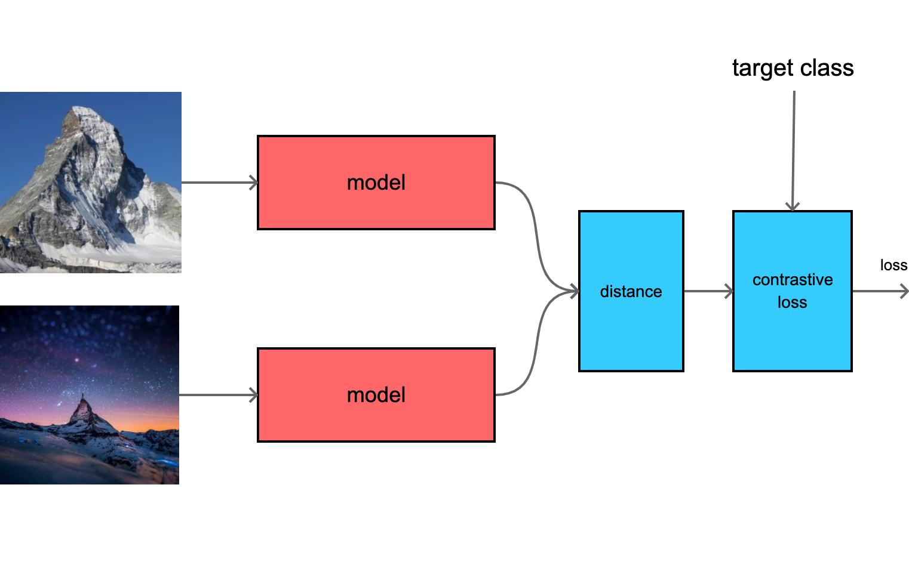
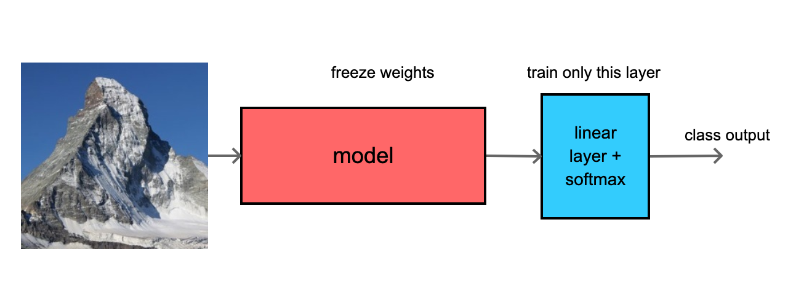

# contrastive learning, MNIST test

model is training to make closer features for same class images, and distance features for different class images




model is simple CNN network, producing 128 features

```python
nn.Conv2d(input_shape[0], 16, kernel_size = 3, stride = 2, padding = 1),
nn.ReLU(),  
nn.Conv2d(16, 32, kernel_size = 3, stride = 2, padding = 1),
nn.ReLU(),
nn.Conv2d(32, 64, kernel_size = 3, stride = 1, padding = 1),
nn.ReLU(), 
nn.Conv2d(64, 64, kernel_size = 3, stride = 1, padding = 0),
nn.ReLU(), 

nn.Flatten(),
nn.Linear(5*5*64, 128),
nn.ReLU()
```

### class IDs
- 0 : input classes are the same,  target = 0
- 1 : input classes are different, target = 1

### model output is simple Euclidean distance : 

```python
fa = model(xa)
fb = model(xb)
  
predicted = ((fa - fb)**2).mean(dim=1)
```

### loss function
```python
l1 = (1.0 - target)*predicted
l2 = target*max(1.0 - predicted, 0)

loss  = (l1 + l2).mean()
```

### results
arround 99.5% accuracy on testing set, training for 10 epochs

```
accuracy   = 99.582 [%]
hit_count  = 10006
miss_count = 42

class_accuracy = 99.34%   99.782%   


confusion_matrix = 
        4969          10
          32        5037
```


# supervised training

after contrastive pretraining, the aditional linear layer is connected and trained just for 1 epoch
for classification

the weights for contrastive model are frozen




```
accuracy   = 99.323 [%]
hit_count  = 9980
miss_count = 68

class_accuracy = 99.901%   99.552%   99.427%   99.385%   99.004%   98.933%   98.608%   99.034%   99.475%   98.851%   


confusion_matrix = 
        1013           0           1           3           0           2           8           0           1           0
           0        1111           0           0           0           0           2           4           0           0
           0           0        1041           1           0           0           0           4           3           0
           0           2           0         969           0           7           0           0           0           1
           0           0           0           0         994           0           0           0           0           4
           0           0           0           0           0         927           0           0           0           0
           0           0           0           0           2           0         921           0           0           0
           0           2           4           1           0           0           0        1025           0           4
           0           0           0           0           1           0           2           0         947           2
           0           0           0           0           6           0           0           1           0        1032

```
