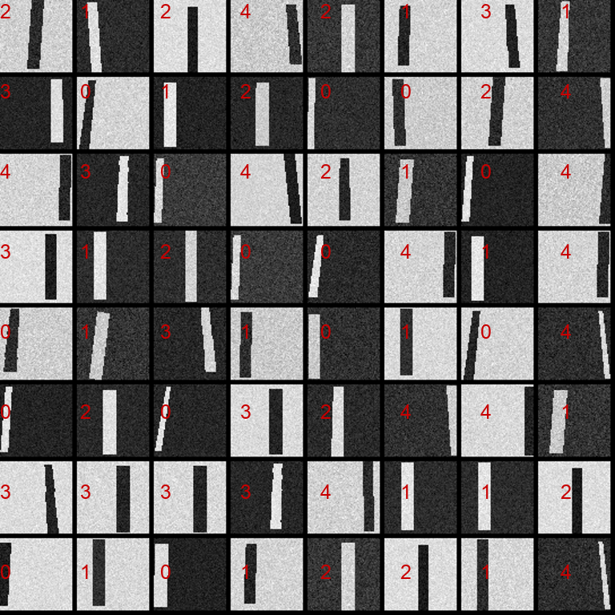
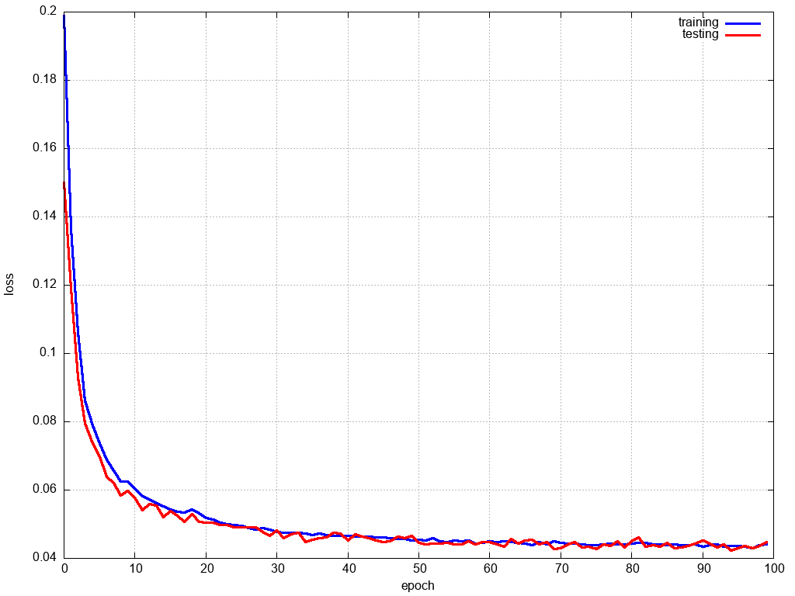
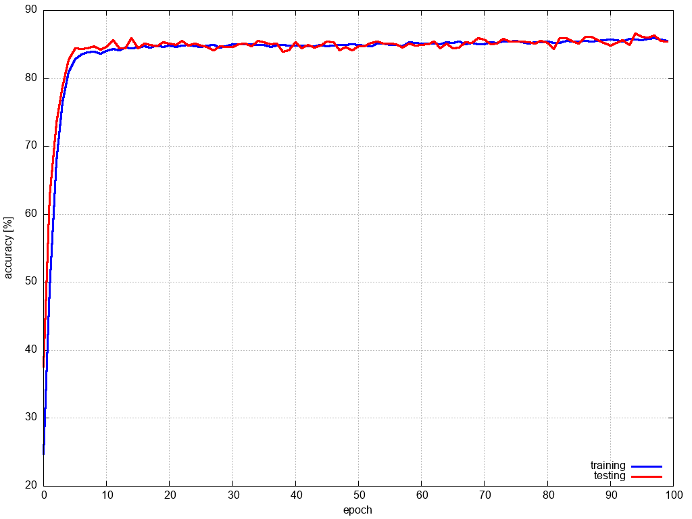
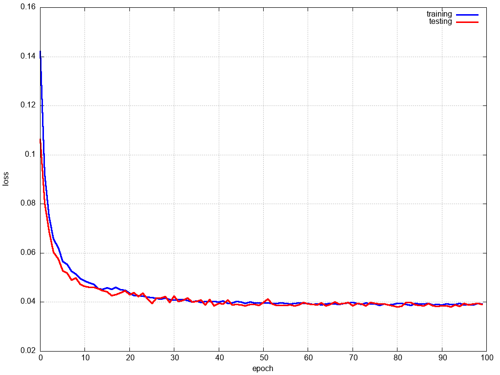
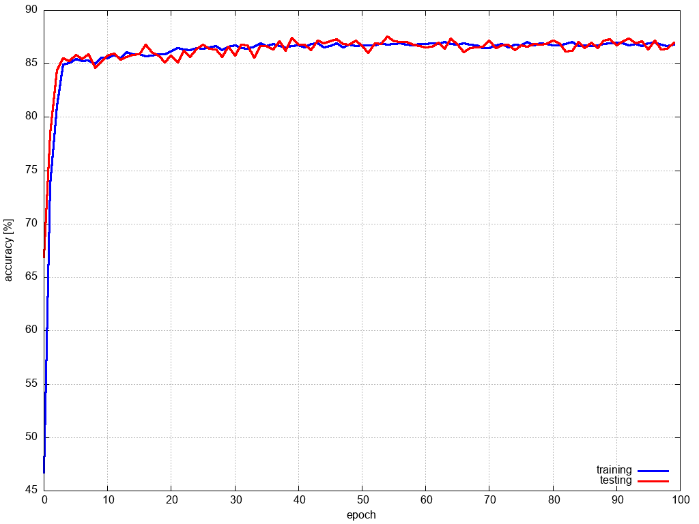

## line classification for line-following robot

5 different line curves

class IDs
- 0 : sharp left
- 1 : soft left
- 2 : straight
- 3 : soft right
- 3 : sharp right

some basic augmentation used : white/black line, random noise, offsets, small rotation

dataset for 8x8 input (line sensors + time staps)

dataset for 64x64 input (small camera)

### hyperparameters

- learning rate : cyclic,  [0.001, 0.0001, 0.0001, 0.0001, 0.00001, 0.00001]
- weight decay  : learning_rate*0.001
- epoch count : 100
- batch size  : 64

### results net_0

2D convs, kernel size 3, stride 2

IN1x8x8 - C4x3/2 - C8x3/2 - FC5

**accuracy   = 86.6 [%]**

class_accuracy = 97.896%   72.92%   97.908%   67.854%   96.107% 

model link : [model.py](models/net_0/model.py)

result link : [/result](models/net_0/result)

embedded code : [/export](models/net_0/export)

### results net_1

2D convs, kernel size 3, stride 2

IN1x8x8 - C8x3/2 - C8x3/2 - FC5

**accuracy   = 87.5 [%]**

class_accuracy = 97.621%   71.834%   98.229%   71.023%   98.362%

model link : [model.py](models/net_1/model.py)

result link : [/result](models/net_1/result)

embedded code : [/export](models/net_1/export)

