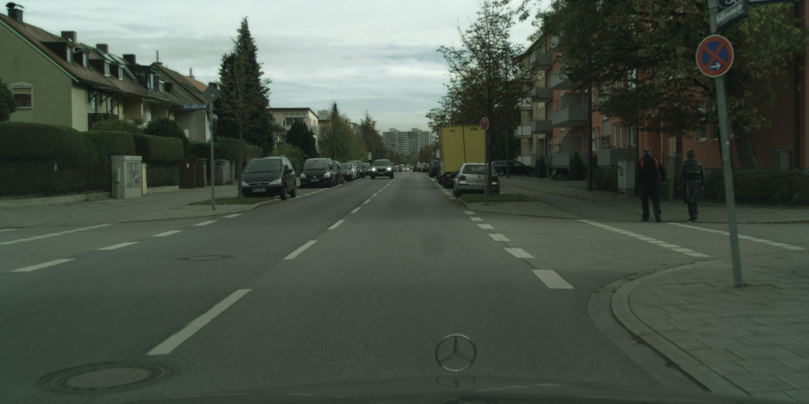
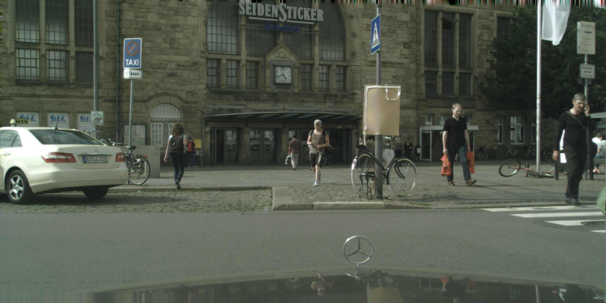

# image segmentation

trained on cityscapes dataset

using only small model - for future usage on NVIDIA Jetson Nano


training 100 epoch, cyclic learning rate

# results








# model

strided convs, residual blocks and tranposed convs

```python
nn.Conv2d(input_shape[0], 32, kernel_size = 3, stride = 2, padding = 1),
nn.ReLU(), 
ResidualBlock(32),
ResidualBlock(32),

nn.Conv2d(32, 64, kernel_size = 3, stride = 2, padding = 1),
nn.ReLU(),
ResidualBlock(64),
ResidualBlock(64),

nn.Conv2d(64, 128, kernel_size = 3, stride = 2, padding = 1),
nn.ReLU(),
ResidualBlock(128),
ResidualBlock(128),

nn.ConvTranspose2d(128, 128, kernel_size = 3, stride = 2, padding = 1, output_padding = 1),
nn.ReLU(),
nn.ConvTranspose2d(128, 64, kernel_size = 3, stride = 2, padding = 1, output_padding = 1),
nn.ReLU(),
nn.ConvTranspose2d(64, 64, kernel_size = 3, stride = 2, padding = 1, output_padding = 1),
nn.ReLU(),

nn.Conv2d(64, 64, kernel_size = 3, stride = 1, padding = 1),
nn.ReLU(),

nn.Conv2d(64, output_shape[0], kernel_size = 1, stride = 1, padding = 0)


class ResidualBlock(torch.nn.Module):
    def __init__(self, channels, weight_init_gain = 1.0):
        super(ResidualBlock, self).__init__()

        
        self.conv0  = nn.Conv2d(channels, channels, kernel_size=3, stride=1, padding=1)
        self.act0   = nn.ReLU()
        self.conv1  = nn.Conv2d(channels, channels, kernel_size=3, stride=1, padding=1)
        self.act1   = nn.ReLU()
            
        torch.nn.init.xavier_uniform_(self.conv0.weight, gain=weight_init_gain)
        torch.nn.init.xavier_uniform_(self.conv1.weight, gain=weight_init_gain)


    def forward(self, x):
        y  = self.conv0(x)
        y  = self.act0(y)
        y  = self.conv1(y)
        y  = self.act1(y + x)
        
        return y
```
